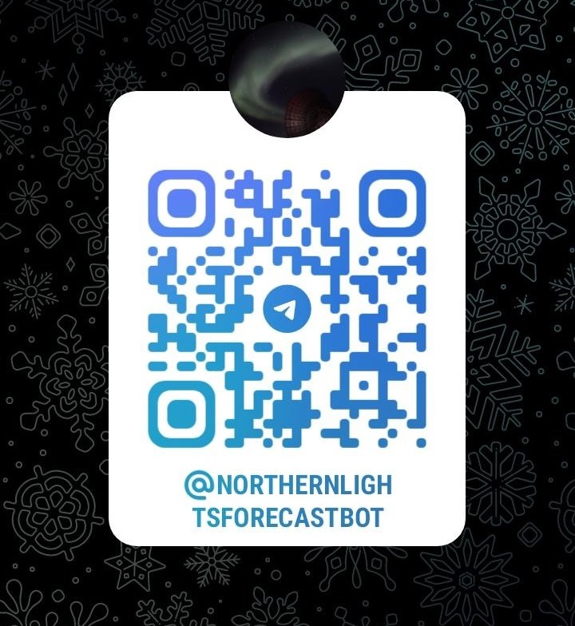

<!-- # [Northern Lights Forecast](https://github.com/engeir/northern-lights-forecast) -->

**nlf — Norther Lights Forecast**
[:link:](https://github.com/engeir/northern-lights-forecast) sender varsler til telegram
boten `@NorthernLightsForecastBot` når det oppstår gode muligheter for å se nordlys nært
Tromsø. Selve programmet kan faktisk også sjekke forholdene på en rekke lokasjoner (se
den fullstendige listen ved å kjøre kommandoen `nlf --locations`), men innstansen jeg
kjører på min raspberry pi som oppdaterer telegram boten lytter kun til Tromsø sitt
magnetogram. Installer og kjør din egen versjon av programmet ved å laste ned via `pip`:

```bash
pip install nlf
```

Eller du kan klone git lageret og installere med `poetry`:

```bash
git clone https://github.com/engeir/northern-lights-forecast.git
poetry install
# Install tesseract and create a telegram bot, then run
nlf -l Tromsø
```

<!--  -->

<!--  -->

 Skann QR koden for å gå
direkte til telegramboten! 


